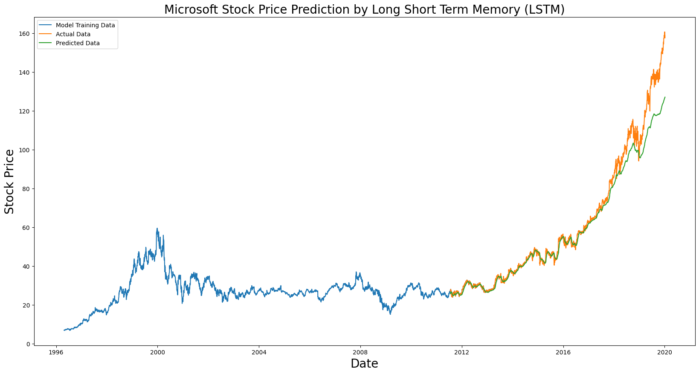

<a name="readme-top"></a>

<!-- PROJECT LOGO -->
<br />
<div align="center">
  <a href= "https://github.com/kumara1917/stockmarketprediction">
    
  </a>

  <h3 align="center">StockPrediction</h3>

  <p align="center">
Enhance your investment decisions with our cutting-edge stock prediction model, leveraging advanced data analysis and machine learning to forecast market trends and empower your financial strategy.!!
  </p>
</div>


<!-- TABLE OF CONTENTS -->
<details>
  <summary>Table of Contents</summary>
  <ol>
    <li>
      <a href="#about-the-project">About The Project</a>
      <ul>
        <li><a href="#built-with">Built With</a></li>
      </ul>
    </li>
    <li>
      <a href="#getting-started">Getting Started</a>
      <ul>
        <li><a href="#prerequisites">Prerequisites</a></li>
        <li><a href="#installation">Installation</a></li>
      </ul>
    </li>
    <li><a href="#usage">Usage</a></li>
    <li><a href="#roadmap">Roadmap</a></li>
    <li><a href="#contributing">Contributing</a></li>
    <li><a href="#license">License</a></li>
    <li><a href="#contact">Contact</a></li>
    <li><a href="#acknowledgments">Acknowledgments</a></li>
  </ol>
</details>


<!-- ABOUT THE PROJECT -->
## About The Project
Our project employs a combination of Long Short-Term Memory (LSTM) neural networks and various other machine learning models to create a robust and accurate stock prediction system. By harnessing the power of LSTM, we can effectively capture and leverage historical stock price patterns, enabling us to make informed forecasts about future market trends. Our approach is data-driven and utilizes a diverse set of features and algorithms, providing a comprehensive and reliable tool for traders and investors to enhance their decision-making process in the complex world of stock market prediction.
<div align="center">

</div>


<p align="right">(<a href="#readme-top">back to top</a>)</p>


### Built With

This section should list any major frameworks/libraries used to bootstrap your project. Leave any add-ons/plugins for the acknowledgements section. Here are a few examples.

* Python

<p align="right">(<a href="#readme-top">back to top</a>)</p>


<!-- GETTING STARTED -->
## Getting Started
To get started with our stock prediction project, follow these steps:

1. Clone the repository to your local machine.
2. Install the required Python dependencies as specified in the README, and you're ready to begin exploring and utilizing the stock prediction model.
### Prerequisites
 Ensure you have Python 3.x installed and the necessary libraries, such as NumPy, Pandas, and TensorFlow, are set up according to the provided instructions in the README before running the stock prediction models.
* pandas
  ```sh
  pip install pandas
  ```
* numpy
    ```sh
  pip install numpy
  ```
* matplotlib
  ```sh
  pip install matplotlib
  ```
### Installation

 Here's a self-contained installation guide for our app, eliminating the need for external dependencies or services.

1. Clone the repository to your local machine:
   ```sh
   git clone https://github.com/kumara1917/stockmarketprediction.git
   ```
2. Navigate to the project directory:
   ```sh
   cd StockPrediction
   ```
3. Run the Python File:
   ```js
   python Stockprediction.py
   ```

<p align="right">(<a href="#readme-top">back to top</a>)</p>


<!-- USAGE EXAMPLES -->
## Usage

* Setup: Easily install the stock prediction system as per the provided instructions.
* Training: Train the LSTM model with historical stock data for trend analysis.
* Predictions: Utilize the model to make accurate stock price predictions.
* Evaluation: Assess model performance using MAE and RMSE metrics.
* Visualization: Visualize predictions versus actual stock prices.
* Documentation: For detailed examples and guidance, consult our user-friendly documentation to enhance your investment strategies.

<p align="right">(<a href="#readme-top">back to top</a>)</p>


<!-- CONTRIBUTING -->
## Contributing

Contributions are what make the open source community such an amazing place to learn, inspire, and create. Any contributions you make are **greatly appreciated**.

If you have a suggestion that would make this better, please fork the repo and create a pull request. You can also simply open an issue with the tag "enhancement".
Don't forget to give the project a star! Thanks again!

1. Fork the Project
2. Create your Feature Branch (`git checkout -b feature/AmazingFeature`)
3. Commit your Changes (`git commit -m 'Add some AmazingFeature'`)
4. Push to the Branch (`git push origin feature/AmazingFeature`)
5. Open a Pull Request

<p align="right">(<a href="#readme-top">back to top</a>)</p>

<!-- CONTACT -->
## Contact

Project Link: [https://github.com/kumara1917/stockmarketprediction](https://github.com/kumara1917/stockmarketprediction)

<p align="right">(<a href="#readme-top">back to top</a>)</p>


<!-- ACKNOWLEDGMENTS -->
## Acknowledgments

We would like to express our gratitude to the following resources and individuals who have contributed to the success of this project
* [Kaggle](https://www.kaggle.com/)
* [AskPython](https://www.askpython.com/)
* [GeeksForGeeks](https://www.geeksforgeeks.org/)
* [GitHub Pages](https://pages.github.com)

<p align="right">(<a href="#readme-top">back to top</a>)</p>


[Python-url]: https://www.python.org/

